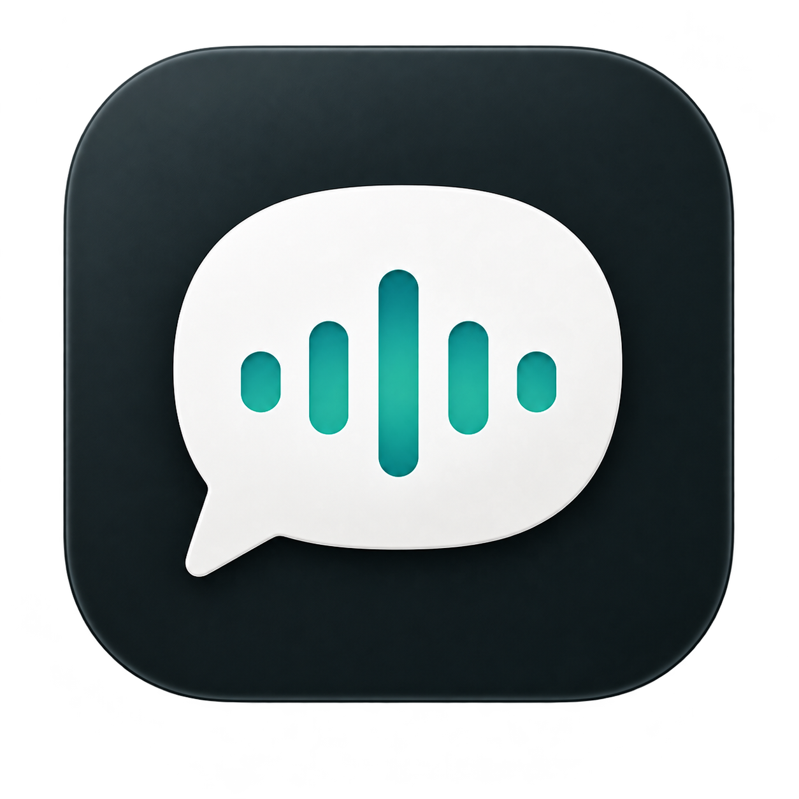

# Yada



**Dictate where you type, with speech processing on your Mac.**

Yada is a native macOS dictation app. Press your shortcut, speak, and press it again to insert finalized text into a supported text field. A small recording pill shows when Yada is listening. Dictation has one default path: preserve the recognizer’s words, tidy spacing, apply any previously saved terminology, and insert. There is no text-mode picker.

**Status:** early personal-development build, not a completed product. On September 25, 2026, Xcode passed all 63 synthetic app tests after a shortcut lifecycle fix; the 10 tooling tests also passed. A signed local testing ZIP is available, but installation into `/Applications` was denied in this workspace. Control+Y from another app, real speech, cross-app insertion and permissions across upgrades still need physical acceptance. Do not share this as a finished dictation app. See [verification and limitations](#verification-and-limitations) and the [delivery plan](plan.md).

## What it does

- Transcribes microphone audio with Apple’s on-device SpeechTranscriber.
- Starts and stops from one configurable global shortcut, with menu-bar and floating-pill controls.
- Inserts into supported active text fields, with preview recovery when the destination cannot be verified.
- Uses one automatic dictation path, without mode selection.
- Keeps the last 50 finalized transcripts locally, including available raw, cleaned and formatted versions.
- Appears in the Dock and Command–Tab and stays running when its window closes.

An experimental Meetings tab now records the microphone and one selected audio process locally, with Pause/Stop and saved-file transcription. Live meeting routing and successful file transcription still need acceptance testing. Yada does not identify speakers or generate meeting notes yet. It does not send messages, submit forms or execute dictated commands.

## Requirements

| Requirement | Purpose |
| --- | --- |
| Apple Silicon Mac running macOS 26 or newer | Native speech and app runtime |
| Xcode 26 with the macOS SDK | Build and run from source |
| Installed Apple speech assets for your language | On-device transcription |
| Microphone permission | Dictation |
| Accessibility permission | Automatic text insertion |

Everyday dictation does not require Apple Intelligence. No API key, Python environment, inference server, simulator or Xcode predictive completion model is needed. A paid Apple Developer account is not required for local development. Public releases require Developer ID signing and notarization; see [release preparation](docs/releases.md).

Initial Swift package resolution and any missing Apple language/model assets need an internet connection. Yada has no hosted inference fallback.

## Build and launch

For everyday testing, run `python3 scripts/package-local.py` from the repository root. It tests and builds a non-notarized DMG without a paid Apple account. Follow [local installation instructions](docs/releases.md), then launch `/Applications/Yada.app`.

The Xcode and Terminal commands below are for development, using a separate development identity.

### In Xcode

1. Open `Yada.xcodeproj`.
2. Allow Swift Package Manager to resolve dependencies.
3. Select the **Yada** scheme and **My Mac** destination.
4. Choose **Product → Run**, or press **Command+R**.

### In Terminal

From the repository root:

```sh
xcodebuild -project Yada.xcodeproj -scheme Yada \
  -destination 'platform=macOS,arch=arm64' -derivedDataPath .build build

open .build/Build/Products/Debug/Yada.app
```

The app bundle is `.build/Build/Products/Debug/Yada.app`. You can also open it in Finder; press **Command+Shift+G** and enter that folder’s absolute path. Finder hides folders beginning with a dot by default.

After rebuilding, preserve any current text, quit the running Yada instance, and reopen the bundle to use the new build. To keep a Dock shortcut, right-click Yada’s Dock icon and choose **Options → Keep in Dock**. Yada does not automatically configure login startup.

## First-time setup

1. Allow microphone and Accessibility access when completing the setup card. macOS owns these permissions; Yada checks the real grants rather than storing a substitute “enabled” flag.
2. Yada checks the saved speech language automatically. If its assets are missing, choose Download language once.
3. Return to your text field and use Control+Y to start and stop. Existing shortcut choices are preserved; Control+Y is assigned only when no shortcut is saved.

The setup card disappears once microphone, Accessibility and language checks pass. Shortcut, language and saved terminology are available under Settings when you deliberately need to change them. Speech-language changes are saved immediately. Permission registration is requested only on the explicit setup button and at most once per app preference domain; subsequent clicks open settings without another automatic request.

Only one normal Yada copy can run at a time. New copies activate an existing production/development copy and exit before registering a shortcut. Updated builds also share a process lock. Older builds do not contain this guard and need to be quit during migration.

Ad-hoc development signatures still change when rebuilt. This can invalidate macOS permission grants even though an enabled row remains in Settings. Use one local testing installation at `/Applications/Yada.app`. Paid enrollment is deferred. Ad-hoc updates may still require permission repair; existing stale Settings rows are not removed by app preferences or the process guard. See [release setup](docs/releases.md).

## Everyday dictation

1. Click inside the destination text field.
2. Press your shortcut, such as **Control+Y**.
3. Wait for **Listening** in the pill or **Recording** in Yada, then speak.
4. Press the same shortcut again to stop and finalize.
5. Yada inserts into the supported destination and keeps it focused after verified insertion.

The bottom-right pill shows microphone-driven level bars while listening. Its Stop button also finalizes; its X button cancels the recording. You can drag the pill’s background. Its position lasts until the app quits.

Starting from Yada’s own window produces a preview. If insertion is unsupported, the app or cursor changed, or delivery cannot be verified, Yada keeps the text available for review and copying. It never automatically retries an uncertain insertion. Check the destination before copying again.

## Default text handling

Yada preserves line breaks, explicit quotations, backticks, fenced code and indented lines while tidying repeated horizontal spaces. Existing terminology rules remain available under Settings → Saved terminology. They are case-sensitive whole-phrase replacements and do not cascade. Original recognizer text remains available in history.

Old saved text-mode choices are ignored at startup so they cannot unexpectedly open a review window or prevent insertion. Unreadable settings retain the faithful unmodified fallback and do not overwrite the old file.

The experimental Apple formatting service and synthetic evaluation harness remain in the codebase, but automatic model modes and their controls have been removed from the dictation interface. The prior quotation/code failures remain documented; generation is not part of the default path.

## Application compatibility

Automatic insertion depends on the text field, not just the app name. A field must expose readable text and cursor/selection information through macOS Accessibility.

- **Native accessible editors:** Yada replaces the selected text directly when that operation is supported. This path does not change the clipboard.
- **Installed Outlook and Teams:** Yada uses a guarded Command+V event sent to the captured process. It places the transcript on the current-host-only clipboard and leaves it there so a delayed paste can read it.
- **Unsupported or changed destinations:** Yada explains the failure and returns a preview.
- **Password fields, Secure Input and known terminal apps:** automatic insertion is excluded.

Yada never sends Return. Checks and cross-process delivery are not atomic, so they cannot eliminate every focus race. The current Microsoft paste path and physical shortcut behavior still require acceptance testing; they are not a promise of universal compatibility.

## Privacy and local storage

Yada has no telemetry, analytics or cloud inference path. Ordinary dictation audio stays in memory and is not saved. Meeting recordings are saved locally until deleted. The destination app controls what happens to text after insertion; dictating into a cloud-connected app does not make that app local.

| Data | Location / behavior |
| --- | --- |
| Last 50 finalized transcripts and available text variants | `~/Library/Application Support/Yada/RecentTranscripts.json` |
| Terminology rules and legacy mode metadata | `~/Library/Application Support/Yada/CleanupSettings.json` |
| Shortcut and speech-language preferences | macOS application preferences |
| Destination field text | Read temporarily for insertion checks; not logged or persisted |

Transcript files use owner-only permissions. Local storage is not application-encrypted, and external backup software may copy it. Existing history loads without a destructive migration; unreadable files are not silently overwritten.

**Clear** removes the current preview. **Recent transcripts → Delete / Clear history** removes saved entries. Cancelling recording discards the active recording; cancelling formatting preserves the already-finalized transcript. Deleting Yada’s copy cannot recall text already copied, inserted or backed up elsewhere.

Explicit copy actions and Microsoft-app paste use the clipboard’s `currentHostOnly` option. Local clipboard managers may still read or sync that text. Clearing a preview does not clear the clipboard.

## Verification and limitations

Run the regression suite from the repository root:

```sh
xcodebuild -project Yada.xcodeproj -scheme Yada \
  -destination 'platform=macOS,arch=arm64' -derivedDataPath .build test
```

**Current automated result, September 25, 2026:** 63 app tests passed in Xcode on an Apple Silicon Mac running macOS 26.7, and 10 Python tooling tests passed. The app suite covers transcript finalization, cancellation, insertion eligibility, history persistence, cleanup rules, permission setup and meeting capture with fake sources. The model timeout regression deliberately takes 30 seconds. Xcode built the updated Release app; its ad-hoc hardened-runtime signature and microphone entitlement were verified, and a ZIP archive passed an integrity check. DMG creation and installation were denied by the local environment, so physical dictation remains unverified.

Tests use synthetic inputs. They do not establish real microphone quality, offline behavior, application compatibility or model fidelity. Native UI automation was unavailable during the latest formatting checks. A later synthetic Apple model evaluation found semantic failures, so model formatting remains outside the everyday dictation flow.

A Debug-only `--ui-preview` driver uses synthetic recognition/formatting, in-memory history/settings and no registered global shortcut. Use the isolated bundle procedure in the [verification skill](.agents/skills/verify-project/SKILL.md); do not use private transcripts as test fixtures.

| Evidence | Contents |
| --- | --- |
| [Dictation acceptance](docs/mvp1-acceptance.md) | Speech lifecycle and physical audio checks |
| [Insertion acceptance](docs/mvp2-acceptance.md) | Destination guards and application test matrix |
| [Cleanup and formatting acceptance](docs/mvp3-acceptance.md) | Transformation, model and review checks |

## Development and roadmap

Yada uses Swift 6, SwiftUI/AppKit, AVAudioEngine, SpeechAnalyzer/SpeechTranscriber and Foundation Models. Its only third-party package is [KeyboardShortcuts 3.0.1](https://github.com/sindresorhus/KeyboardShortcuts/tree/3.0.1), licensed under MIT and pinned through Swift Package Manager.

| Directory | Responsibility |
| --- | --- |
| `Yada/App/` | Windows, menu bar, recording pill and controls |
| `Yada/Audio/` | Microphone capture and conversion |
| `Yada/Recognition/` | Apple speech recognition and language setup |
| `Yada/Dictation/` | Session lifecycle and local history |
| `Yada/Delivery/` | Active-field checks and insertion |
| `Yada/Text/` | Cleanup, terminology and local formatting |
| `YadaTests/` | Synthetic regression tests |

The next priority is installing one everyday copy and testing Control+Y and insertion in TextEdit, Notes, Outlook and Teams. Then verify relaunch, upgrade, offline speech and permission retention on this Mac and a second supported Mac. Local packaging and the first meeting-recording slice are implemented; meeting acceptance, speaker labels and grounded notes remain separate future work.

- [Build plan](plan.md): ordered work and instructions for resuming testing.
- [Product and technical specification](Yada_Product_and_Technical_Spec.md): design decisions and future scope.
- [First-build prompt](Yada_First_Build_Prompt.md): historical starting requirements.
- [Apple SpeechTranscriber](https://developer.apple.com/documentation/speech/speechtranscriber) and [SystemLanguageModel](https://developer.apple.com/documentation/foundationmodels/systemlanguagemodel): platform API references.

## Development identity and release preparation

Debug builds now appear as **Yada Development** (`com.srinidhi621.yada.dev`) and use `~/Library/Application Support/Yada Development/` for history and cleanup settings. Existing everyday Yada data stays in `~/Library/Application Support/Yada/`; it is not copied or deleted. Development builds have their own macOS permissions and preferences. The production identifier remains `com.srinidhi621.yada`.

The Setup panel shows microphone and Accessibility status, opens the relevant settings on request, and checks permissions again when you return. Shortcuts no longer trigger repeated system permission dialogs. The existing installed/running app is not replaced by these source changes.

The local package workflow is `scripts/package-local.py`; the optional paid-signing workflow remains in `scripts/release.py`. Ten tooling tests cover both paths. A non-notarized testing DMG has been produced; no notarized installer or GitHub release artifact has been published. See [installation instructions](docs/releases.md).

The [18-case local formatting evaluation](docs/formatting-evaluation-2026-09-07.md) found failures with quotations and code. Model output still requires review; its semantic acceptance gate remains open.

## Experimental meeting recorder

The Meetings tab adds explicit, consented recording of a selected audio process plus your microphone. Unlike ordinary dictation, meeting audio is saved locally until you delete it. Use headphones; muting in Teams does not mute Yada. Pause releases both capture sources.

Saved sessions contain separate CAF tracks and a manifest, with optional Markdown transcription after Stop. The current transcription path handles short chunks independently and can lose or repeat boundary words. Do not treat it as verified long-meeting transcription yet. See [meeting acceptance and launch instructions](docs/meeting-capture-acceptance.md) for the required permissions, known readiness blocker and synthetic test evidence.
